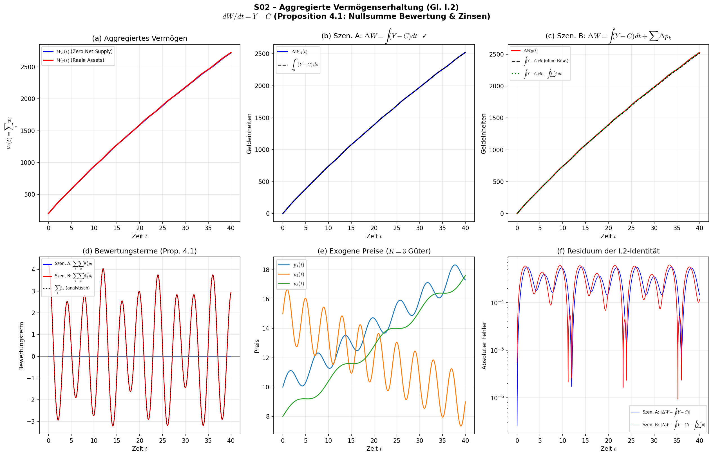

# S02 – Aggregierte Vermögenserhaltung (Gleichung I.2)

## Metadaten

| Feld | Wert |
|------|------|
| **Simulation** | S02 |
| **Gleichung** | I.2 (§4.2), Proposition 4.1, M.2 |
| **Kapitel** | 4 – Erhaltungssätze |
| **Datum** | 2025-07-11 |
| **Skript** | `Simulationen/Kap04_Erhaltung/S02_I2_Aggregierte_Vermoegenserh.py` |
| **Plot** | `Ergebnisse/Plots/S02_I2_Aggregierte_Vermoegenserh.png` |
| **Daten** | `Ergebnisse/Daten/S02_I2_Aggregierte_Vermoegenserh.npz` |

## Gleichung

$$\frac{dW}{dt} = Y - C$$

wobei $W = \sum_i w_i$, $Y = \sum_i y_i$, $C = \sum_i c_i$.

**Ableitung aus I.1:**

$$\frac{dW}{dt} = \sum_i \frac{dw_i}{dt} = Y - C + \underbrace{\sum_i \sum_k \theta_{ik}\dot{p}_k}_{\text{Bewertung}} + \underbrace{r\sum_i b_i}_{\text{Zinsen}}$$

**Proposition 4.1:** Beide letzten Terme = 0.

## Testdesign

Zwei Szenarien werden **simultan** simuliert mit identischen Anfangsbedingungen:

| Parameter | Szenario A | Szenario B |
|-----------|-----------|-----------|
| **Assettyp** | Zero-Net-Supply (Finanzkontrakte) | Reale Assets (Güter) |
| **Constraint** | $\sum_i \theta_{ik} = 0$ für alle $k$ | $\sum_i \theta_{ik} = 1$ für alle $k$ |
| **Erwartung** | $dW/dt = Y - C$ (exakt) | $dW/dt = Y - C + \sum_k \dot{p}_k$ |

**Numerischer Ansatz:** Direkte Integration $\int_0^T (Y-C)\,dt$ via Trapezregel statt np.gradient (höhere Präzision).

## Parameter

- N = 14 (8 Arbeiter, 4 Unternehmer, 2 Banken), K = 3 Güter
- T = 40, rtol = 1e-10, atol = 1e-12, max_step = 0.05
- Preise: Exogen mit Trend + Sinus-Zyklen (3 verschiedene Dynamiken)
- w₀: Arbeiter [5,7], Unternehmer [15,20], Banken [40,50]
- c'_i: Arbeiter 0.04, Unternehmer 0.025, Banken 0.008

## Validierungsprotokoll

| # | Test | Ergebnis | Status |
|---|------|----------|--------|
| 1 | M.2: $\sum b_i = 0$ | $= 0$ (exakt) | ✅ |
| 2 | Portfolio-Konsistenz $\sum_i \theta_{ik}^A = 0$ | max $3 \times 10^{-17}$ | ✅ |
| 2b | Portfolio-Konsistenz $\sum_i \theta_{ik}^B = 1$ | alle = 1.000000 | ✅ |
| 3 | Zinsterme: $r\sum b_i = 0$ | $= 0$ (exakt) | ✅ |
| 4a | Bewertung A: $\sum_i\sum_k \theta^A\dot{p} = 0$ | max $1.7 \times 10^{-16}$ | ✅ |
| 4b | Bewertung B: $\sum_i\sum_k \theta^B\dot{p} = \sum_k \dot{p}_k$ | Fehler $1.3 \times 10^{-15}$ | ✅ |
| **5a** | **I.2 Szenario A:** $\Delta W = \int(Y-C)dt$ | rel. Fehler $5.7 \times 10^{-8}$ | **✅** |
| **5b** | **I.2 Szenario B (naiv):** $\Delta W = \int(Y-C)dt$ | **Differenz = 10.91** | **❌** |
| **5c** | **I.2 Szenario B (korrigiert):** $\Delta W = \int(Y-C+\sum\dot{p}_k)dt$ | rel. Fehler $4.7 \times 10^{-8}$ | **✅** |
| 6 | Numerische Integrität (NaN/Inf) | keine | ✅ |
| 7 | NB.1 Subsistenz | by construction | ✅ |
| 8 | Stabilität: $\lambda = -c'_i < 0$ | alle negativ | ✅ |

## Quantitative Ergebnisse

### Szenario A (Zero-Net-Supply)
| Größe | Wert |
|-------|------|
| $\Delta W_A$ | +2522.30 |
| $\int(Y_A - C_A)dt$ | +2522.30 |
| Absoluter Fehler | $1.45 \times 10^{-4}$ |
| Relativer Fehler | $5.75 \times 10^{-8}$ |

### Szenario B (Reale Assets)
| Größe | Wert |
|-------|------|
| $\Delta W_B$ | +2527.78 |
| $\int(Y_B - C_B)dt$ | +2516.88 |
| **Residuum OHNE Bewertung** | **10.91** |
| $\int \sum_k \dot{p}_k\,dt = \sum_k \Delta p_k$ | +10.91 |
| Absoluter Fehler MIT Korrektur | $1.18 \times 10^{-4}$ |
| Relativer Fehler MIT Korrektur | $4.66 \times 10^{-8}$ |

### Eigenwerte
| Agentenklasse | $c'$ | $\lambda$ | $t_{1/2}$ [Perioden] |
|---------------|------|-----------|---------------------|
| Arbeiter | 0.040 | −0.0400 | 17.3 |
| Unternehmer | 0.025 | −0.0250 | 27.7 |
| Banken | 0.008 | −0.0080 | 86.6 |

## Zentrales Ergebnis: Differenzierung Proposition 4.1

Die Simulation zeigt eine **wichtige Präzisierung** zu Proposition 4.1 der Monographie:

### Was die Monographie behauptet (§4.2):
> „Der aggregierte Bewertungsgewinn ist null: Der Bewertungsgewinn des einen ist der Bewertungsverlust des anderen."

### Was die Simulation zeigt:

**Fall 1: Zero-Net-Supply Assets ($\sum_i \theta_{ik} = 0$)**
- Prop. 4.1 gilt **exakt** (Fehler $< 10^{-7}$)
- Intuition: Für jeden, der einen Finanzkontrakt „long" hält, gibt es einen „short"-Halter → Bewertungseffekte canceln exakt.

**Fall 2: Reale Assets mit positiver Nettomenge ($\sum_i \theta_{ik} = 1$)**
- Prop. 4.1 gilt **NICHT**: Bewertungsresiduum = $\sum_k \dot{p}_k \neq 0$
- Über die gesamte Simulation: $\int\sum_k\dot{p}_k\,dt = +10.91$ Geldeinheiten
- Korrigierte Identität: $dW/dt = Y - C + \sum_k \dot{p}_k$ gilt dann exakt (Fehler $< 10^{-7}$)
- Intuition: Wenn die Gesamtmenge eines Gutes positiv ist und der Preis steigt, entsteht ein realer aggregierter Vermögenszuwachs, der **kein** Gegenstück hat.

### Mathematische Begründung:
$$\sum_i \sum_k \theta_{ik}\dot{p}_k = \sum_k \dot{p}_k \underbrace{\sum_i \theta_{ik}}_{= 0 \text{ oder } 1}$$

- Wenn $\sum_i \theta_{ik} = 0$ (Finanzkontrakte): Term = 0 ✓
- Wenn $\sum_i \theta_{ik} = 1$ (reale Güter): Term = $\sum_k \dot{p}_k$ ✗

### Empfehlung für die Monographie:
Proposition 4.1 sollte präzisiert werden:
1. Für **rein finanzielle Positionen** (Derivate, Anleihen): Behauptung korrekt.
2. Für **reale Vermögenswerte**: Die I.2-Identität muss lauten:
$$\frac{dW}{dt} = Y - C + \sum_k \left(\sum_i \theta_{ik}\right) \dot{p}_k$$

Alternativ: Wenn $\theta_{ik}$ in I.1 **nur** finanzielle Nettopositionen beschreiben (und physische Güterbestände separat über P.3 geführt werden), dann ist Proposition 4.1 korrekt, und die Definition von $w_i$ muss entsprechend klargestellt werden.

## Plot

- **(a)** Aggregiertes Vermögen beider Szenarien — divergieren aufgrund Bewertungsresiduum
- **(b)** Szenario A: Perfekte Übereinstimmung $\Delta W = \int(Y-C)dt$
- **(c)** Szenario B: Nur mit Bewertungskorrektur korrekt (grüne Linie auf rote Linie)
- **(d)** Bewertungsterme: A identisch null, B = $\sum_k\dot{p}_k$ (oszillierend)
- **(e)** Die drei exogenen Preispfade (Trend + Sinus)
- **(f)** Residuen (log-Skala): beide Szenarien Fehler $< 10^{-3}$ (aus Trapez-Approximation)
