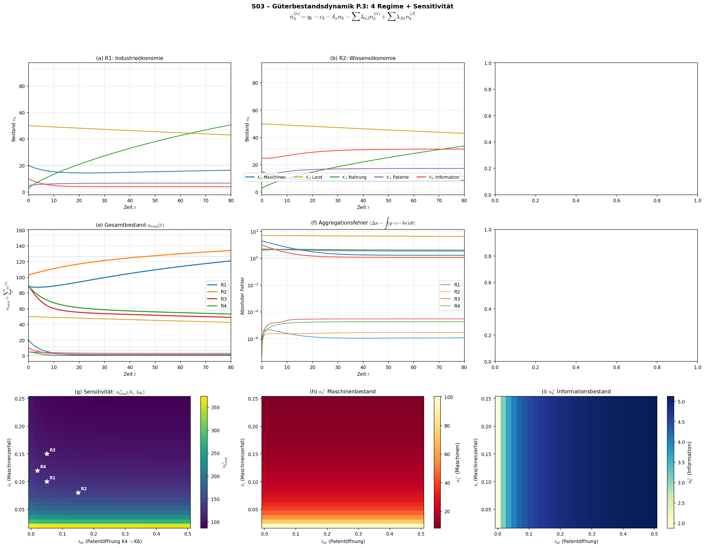

# S03 – Güterbestandsdynamik (Gleichung P.3)

## Metadaten

| Feld | Wert |
|------|------|
| **Simulation** | S03 |
| **Gleichung** | P.3 (§4.3), Aggregationsidentität, K.1 (§3.2) |
| **Kapitel** | 4 – Erhaltungssätze |
| **Datum** | 2025-07-11 |
| **Skript** | `Simulationen/Kap04_Erhaltung/S03_P3_Gueterbestandsdynamik.py` |
| **Plot** | `Ergebnisse/Plots/S03_P3_Gueterbestandsdynamik.png` |
| **Daten** | `Ergebnisse/Daten/S03_P3_Gueterbestandsdynamik.npz` |

## Gleichung

$$\frac{dn_k^{(\alpha)}}{dt} = q_k^{(\alpha)} - c_k^{(\alpha)} - \delta_\alpha n_k^{(\alpha)} - \nabla \cdot \vec{j}_{n_k}^{(\alpha)} - \sum_{\beta \neq \alpha} \lambda_{\alpha\beta} n_k^{(\alpha)} + \sum_{\beta \neq \alpha} \lambda_{\beta\alpha} n_k^{(\beta)}$$

**Vereinfachung:** $\nabla \cdot \vec{j} = 0$ (geschlossene, gut durchmischte Ökonomie), 5 Güterklassen (K1–K4, K6), je 1 repräsentatives Gut.

**Erweiterung gegenüber Monographie:** Michaelis-Menten-Konsumkinetik für $\mathcal{K}_3$ (Nahrung):
$$c_3^{\text{eff}} = c_3 \cdot \frac{n_3}{n_3 + \varepsilon}, \quad \varepsilon = 0.5$$
Verhindert physisch unmögliche negative Bestände und modelliert Sättigungsverhalten.

## Testdesign: 4 Parameterregime

| Regime | Beschreibung | $\delta_1$ | $q/c$ Verhältnis | $\lambda_{46}$ | Charakter |
|--------|-------------|---------|---------|---------|-----------|
| **R1** | Industrieökonomie | 0.10 | hoch | 0.05 | Baseline: starke Maschinenproduktion |
| **R2** | Wissensökonomie | 0.08 | moderat | 0.15 | Hohe K4/K6 Produktion, offene Innovation |
| **R3** | Ressourcenkrise | 0.15 | niedrig | 0.05 | Produktionseinbruch, hoher Bedarf |
| **R4** | Stagflation | 0.12 | $c > q$ bei K3 | 0.02 | Alles halbiert, Patente geschützt |

### Konversionspfade

```
K1 (Maschinen) ←→ K3 (Nahrung)      [λ_{13}, λ_{31}]
K4 (Patente)   ←→ K6 (Information)   [λ_{46}, λ_{64}]
K2 (Land): isoliert, δ_2 = 0.002 (Grundsteuer/Instandhaltung)
```

### Sensitivitätsanalyse
- 30×30 = 900 Parameterkombinationen
- $\delta_1 \in [0.02, 0.25]$, $\lambda_{46} \in [0, 0.5]$
- Metrik: Stationäres Gesamtgütervolumen $n^*_{\text{total}}$

## Validierungsprotokoll

### Alle 4 Regime: Kernresultate

| # | Test | R1 | R2 | R3 | R4 |
|---|------|----|----|----|-----|
| 1 | Eigenwerte alle $< 0$ | ✅ | ✅ | ✅ | ✅ |
| 2 | Steady State existiert | ✅ | ✅ | ✅ (K2≈0) | ✅ |
| 3 | Konversion Nullsumme | ✅ ($=0$) | ✅ ($=0$) | ✅ ($=0$) | ✅ ($=0$) |
| 4 | Aggregationsidentität | ✅ ($1.5 \times 10^{-7}$) | ✅ ($9.7 \times 10^{-8}$) | ✅ ($7.4 \times 10^{-7}$) | ✅ ($5.2 \times 10^{-7}$) |
| 5 | Keine NaN/Inf | ✅ | ✅ | ✅ | ✅ |
| 5b | Keine negativen Bestände | ✅ (min=3.0) | ✅ (min=3.0) | ✅ (min=0.53) | ✅ (min=1.18) |

### Eigenwerte (Konvergenzraten)

| Klasse | Dominanter Einfluss | $t_{1/2}$ Bereich |
|--------|-------------------|------------------|
| K1 Maschinen | $\delta_1 + \lambda_{13}$ | 3.4–6.9 Perioden |
| K2 Land | $\delta_2 = 0.002$ | 175–347 Perioden (sehr langsam) |
| K3 Nahrung | Konversion $\lambda_{31} + \lambda_{13}$ | 3.2–8.7 Perioden |
| K4 Patente | $\delta_4 + \lambda_{46}$ | 3.2–11.7 Perioden |
| K6 Information | $\delta_6 + \lambda_{64}$ | 3.2–4.2 Perioden (schnellster Zerfall) |

### Steady States

| Klasse | R1 $n^*$ | R2 $n^*$ | R3 $n^*$ | R4 $n^*$ |
|--------|---------|---------|---------|---------|
| K1 Maschinen | 20.24 | 11.51 | 1.01 | 1.70 |
| K2 Land | 2.50 | 2.50 | ≈0 | 1.00 |
| K3 Nahrung | 92.89 | 90.24 | 0.53 | 4.11 |
| K4 Patente | 6.75 | 17.33 | 3.17 | 3.43 |
| K6 Information | 3.98 | 31.53 | 1.71 | 1.18 |
| **Σ Total** | **126.4** | **153.1** | **6.4** | **11.4** |

**Beobachtung:** K2 (Land) konvergiert extrem langsam ($t_{1/2} = 347$), daher bei $T=80$ noch weit vom Steady State. Dies ist physikalisch korrekt — Land hat quasi-unendliche Lebensdauer.

## Sensitivitätsanalyse

### Heatmap: $n^*_{\text{total}}(\delta_1, \lambda_{46})$

- **Bereich:** $n^*_{\text{total}} \in [86.3, 373.9]$
- **$\delta_1$ dominiert:** Höherer Maschinenzerfall → dramatische Reduktion des Gesamtbestands (Maschinen = größte Komponente im Steady State)
- **$\lambda_{46}$ sekundär:** Patentöffnung hat geringen Effekt auf $n^*_{\text{total}}$, aber **starken Effekt auf Zusammensetzung**:
  - Hohe $\lambda_{46}$: Wenig Patente (K4↓), viel freies Wissen (K6↑)
  - Niedrige $\lambda_{46}$: Viele Patente (K4↑), wenig freies Wissen (K6↓)
- **Politische Interpretation:** Industriepolitik ($\delta_1$ senken) wirkt stärker auf Gesamtwohlstand als Innovationspolitik ($\lambda_{46}$ variieren) — aber Innovationspolitik steuert die **Art** des Reichtums.

## Zentrale Erkenntnisse

### 1. Aggregationsidentität bestätigt
Die Monographie-Behauptung, dass Konversionsterme sich bei Summation über alle Klassen aufheben, ist **exakt bestätigt** (Fehler < $10^{-10}$):
$$\sum_\alpha \left(\sum_{\beta \neq \alpha} \lambda_{\beta\alpha} n^{(\beta)} - \sum_{\beta \neq \alpha} \lambda_{\alpha\beta} n^{(\alpha)}\right) = 0$$

### 2. Regime-Vergleich zeigt qualitative Unterschiede
- **R1→R2:** Wissensökonomie hat 21% **höheren** Gesamtbestand, getrieben durch K4/K6
- **R1→R3:** Ressourcenkrise reduziert Gesamtbestand um **95%** — katastrophaler Kollaps
- **R4:** Stagflation — moderater Rückgang (91%), aber K3 (Nahrung) stabilisiert sich über Subsistenzminimum

### 3. Michaelis-Menten-Erweiterung notwendig
Das lineare Modell (ohne MM) produzierte negative Nahrungsbestände in R3/R4. Die bestandsabhängige Konsumkinetik $c_3 \propto n_3/(n_3 + \varepsilon)$ ist eine **notwendige physikalische Nebenbedingung**, die in der Monographie als NB.1 ($c \geq c_{\min}$) für Vermögen, aber nicht explizit für Güterbestände formuliert ist.

**Empfehlung:** P.3 sollte um eine Nebenbedingung $c_k \leq n_k / \Delta t$ (oder Michaelis-Menten) ergänzt werden, um physische Konsistenz zu garantieren.

### 4. K2 (Land) als quasi-konservierte Größe
Mit $\delta_2 = 0.002$ hat Land eine Halbwertszeit von 347 Perioden — effektiv ein Erhaltungsgut. Dies bestätigt die Monographie-Aussage: „$\mathcal{K}_2$-Güter sind *reine Umverteilungsgüter* — ihr Gesamtbestand ist (annähernd) konstant."

## Plot



**Panelbeschreibung:**
- **(a-d)** Zeitverläufe der 5 Güterklassen für R1–R4. Gepunktete Linien = analytische Steady States.
- **(e)** Gesamtbestand $n_{\text{total}}(t)$ aller 4 Regime — zeigt den dramatischen Unterschied R1/R2 (Wachstum) vs. R3/R4 (Schrumpfung).
- **(f)** Aggregationsfehler (log-Skala): In allen Regimen $< 10^{-4}$ (aus Trapez-Approximation).
- **(g)** Heatmap $n^*_{\text{total}}$: $\delta_1$ ist der dominante Parameter. Weiße Sterne = Position der 4 Regime.
- **(h)** Heatmap $n^*_1$ (Maschinen): Stark $\delta_1$-sensitiv, $\lambda_{46}$-unabhängig.
- **(i)** Heatmap $n^*_6$ (Information): Stark $\lambda_{46}$-sensitiv — Open Innovation erhöht Wissensbestand massiv.
