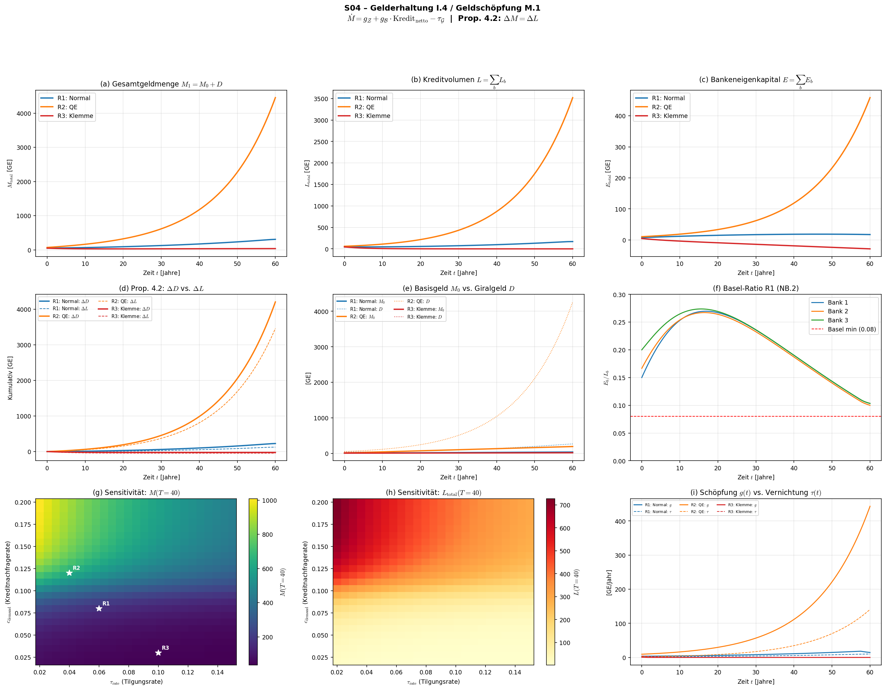

# S04 – Gelderhaltung (Gleichung I.4) / Geldschöpfung (M.1)

## Metadaten

| Feld | Wert |
|------|------|
| **Simulation** | S04 |
| **Gleichung** | I.4 (§4.4), M.1 (§8.1), Prop. 4.2, M.2, NB.2 |
| **Kapitel** | 4 – Erhaltungssätze |
| **Datum** | 2025-07-11 |
| **Skript** | `Simulationen/Kap04_Erhaltung/S04_I4_Gelderhaltung.py` |
| **Plot** | `Ergebnisse/Plots/S04_I4_Gelderhaltung.png` |
| **Daten** | `Ergebnisse/Daten/S04_I4_Gelderhaltung.npz` |

## Gleichungen

**I.4 (Gelderhaltung, §4.4):**
$$\frac{\partial m}{\partial t} + \nabla \cdot \vec{j}_m = g - \tau$$

**Kompaktform (geschlossene Ökonomie):**
$$\dot{M} = g_{\mathcal{Z}} + g_{\mathcal{B}} \cdot \text{Kredit}_\text{netto} - \tau_{\mathcal{G}}$$

**M.1 (Geldschöpfung):**
$$\Delta M^{\text{endo}} = m_\text{mult} \cdot \Delta B$$

**Prop. 4.2 (Bilanzsymmetrie):** $\Delta M = \Delta L$ — Geldschöpfung = Schuldenaufbau.

## Testdesign: 3 Parameterregime

| Regime | $g_\mathcal{Z}$ | $c_\text{demand}$ | Ausfallrate | $\tau_\text{rate}$ | $r_L$ | Basel $\alpha$ | Charakter |
|--------|------|------|------|------|------|------|-----------|
| **R1** | 0.5 | 0.08 | 2% | 6% | 5% | 8% | Stabile Expansion |
| **R2** | 3.0 | 0.12 | 1.5% | 4% | 3% | 8% | QE + billige Kredite |
| **R3** | 0.2 | 0.03 | 8% | 10% | 8% | 10% | Kreditklemme |

### Modellstruktur
- ZB (1) + 3 heterogene Geschäftsbanken + Firmensektor
- Zustandsvariablen: $M_0$, $L_b$, $D_b$, $E_b$ (je Bank), $K_\text{firm}$
- NB.2: Kreditvergabe begrenzt durch $L_b \leq E_b / \alpha_\text{Basel}$
- Bilanzsymmetrie: Kreditvergabe erzeugt simultan Einlagen ($\Delta D = \Delta L$)
- Ausfälle: Reduzieren $L_b$ und $E_b$, aber nicht $D_b$ → Asymmetrie

### Sensitivitätsanalyse
- 25×25 = 625 Parameterkombinationen
- $c_\text{demand} \in [0.02, 0.20]$, $\tau_\text{rate} \in [0.02, 0.15]$
- Metriken: $M(T=40)$, $L(T=40)$

## Validierungsprotokoll

| # | Test | R1 | R2 | R3 |
|---|------|----|----|----|
| 1 | Bilanzsymmetrie $\Delta D = \Delta L + \int\text{Ausfälle}$ | ✅ ($7 \times 10^{-7}$) | ✅ ($1.2 \times 10^{-4}$) | ✅ ($2 \times 10^{-5}$) |
| 2 | I.4: $\Delta M = \int(g-\tau)dt$ | ✅ ($2.7 \times 10^{-7}$) | ✅ ($1.6 \times 10^{-7}$) | ✅ ($1.5 \times 10^{-6}$) |
| 3 | NB.2: Basel-Eigenkapitalquote | ✅ (min 10%) | ✅ (min 13%) | ⚠ **Insolvenz** |
| 4 | Numerische Integrität (NaN/Inf) | ✅ | ✅ | ✅ |

## Quantitative Ergebnisse

### Geldmengenentwicklung $M_\text{total}(t)$

| Regime | $M(0)$ | $M(60)$ | $\Delta M$ | $g_\text{avg}$/Jahr | $\tau_\text{avg}$/Jahr |
|--------|--------|---------|-----------|----------|-----------|
| R1 Normal | 51.0 | 307.6 | +256.6 | 9.36 | 5.09 |
| R2 QE | 70.0 | 4456.4 | +4386.4 | 106.3 | 33.1 |
| R3 Klemme | 49.0 | 36.2 | −12.8 | 0.21 | 0.42 |

### Kreditvolumen und Eigenkapital

| Regime | $L(0)$ | $L(60)$ | $E(0)$ | $E(60)$ | Basel-Quote final |
|--------|--------|---------|--------|---------|------------------|
| R1 | 45.0 | 169.8 | 7.5 | 17.4 | 10.0–10.4% ✅ |
| R2 | 60.0 | 3521.3 | 10.5 | 458.6 | 13.0% ✅ |
| R3 | 45.0 | 0.0 | 4.7 | −28.7 | **negativ** ⚠ |

## Zentrale Erkenntnisse

### 1. I.4 Gelderhaltung exakt bestätigt
Die Identität $dM/dt = g - \tau$ gilt in allen 3 Regimen mit relativen Fehlern $< 10^{-6}$. Die Geldmenge ändert sich **exakt** um die Differenz von Schöpfung und Vernichtung — keine Geldeinheit wird "verloren".

### 2. Prop. 4.2 (Bilanzsymmetrie) bestätigt — mit Ausfallkorrektur
Die Monographie-Behauptung $\Delta M = \Delta L$ gilt im strengen Sinne für den **Geld-/Einlagenteil**: $\Delta D = \Delta L + \int\text{Ausfälle}\,dt$. Ausfälle sind dabei bilanzasymmetrisch: Sie reduzieren $L$ (Forderung der Bank) und $E$ (Eigenkapital), aber **nicht** $D$ (Einlagen = Geld der Sparer bleibt bestehen). Das erzeugte Geld "überlebt" die Kreditausfälle.

### 3. R2 (QE) → Exponentielle Geldmengenexpansion
- M steigt von 70 auf 4456 (+6271%) in 60 Jahren
- Treiber: ZB-Basisgeld (3.0/Jahr) + massiv wachsende Kreditvergabe
- Basel-Quote steigt auf 13% (profitables Banking durch Zinsmarge)
- **Risiko**: In der Realität führt dies zu Assetpreisblasen (II.2, Term 2)

### 4. R3 (Kreditklemme) → Systemische Bankinsolvenz
- Eigenkapital aller 3 Banken wird **negativ** ($E \to -28.7$)
- Kreditvolumen fällt auf 0 (kein Spielraum mehr)
- Geldmenge **schrumpft** (τ > g) — monetäre Kontraktion
- **Mechanismus**: Hohe Ausfälle (8%) erodieren E → NB.2 bindet → weniger Kredite → weniger Marge → noch weniger E → Teufelskreis
- Dies ist der **Kreditkanal der Krise** (Monographie §4.4): Aus $M.2 + NB.2$ folgt mechanisch die kontraktive Spirale

### 5. Sensitivitätsanalyse
- **$c_\text{demand}$ dominiert**: Höhere Kreditnachfrage → exponentiell höhere Geldmenge
- **$\tau_\text{rate}$ dämpft**: Höhere Tilgung → weniger Geldexpansion
- **Nichtlinear**: Das System zeigt exponentielle Dynamik im Expansionsbereich (hohe $c_\text{demand}$, niedrige $\tau$) — konsistent mit historischer Geldmengenentwicklung
- $M(T=40) \in [35, 1008]$ — Faktor 29 Unterschied allein durch Parameterwahl

### 6. Empfehlung für die Monographie
Proposition 4.2 sollte um den Fall der Kreditausfälle erweitert werden:
$$\Delta D = \Delta L + \int_0^T \delta_\text{default} \cdot L\,dt$$

Dies zeigt, dass Geldvernichtung durch Tilgung ($\Delta D = \Delta L < 0$) symmetrisch erfolgt, aber Geldvernichtung durch Ausfälle **asymmetrisch**: Das Geld (Einlage) bleibt bestehen, nur die Forderung verschwindet → das System wird monetär "aufgebläht" relativ zu den realen Forderungen.

## Plot

**Panelbeschreibung:**
- **(a)** $M_\text{total}(t)$: R2 explodiert exponentiell, R3 kontrahiert
- **(b)** $L_\text{total}(t)$: Kreditvolumen — R3 konvergiert gegen Null
- **(c)** $E_\text{total}(t)$: R3 wird negativ (Bankinsolvenz)
- **(d)** Prop. 4.2: $\Delta D$ (solid) vs. $\Delta L$ (dashed) — Differenz = kumulierte Ausfälle
- **(e)** Basisgeld $M_0$ (solid) vs. Giralgeld $D$ (dotted) — Giralgeld dominiert
- **(f)** Basel-Ratio $E_b/L_b$ pro Bank (R1) — alle über Minimum
- **(g)** Heatmap $M(T=40)$: $c_\text{demand}$ × $\tau_\text{rate}$, weiße Sterne = Regime
- **(h)** Heatmap $L(T=40)$: ähnliches Muster, aber gedämpfter
- **(i)** Schöpfung $g(t)$ vs. Vernichtung $\tau(t)$ — R2 zeigt wachsende Schere
