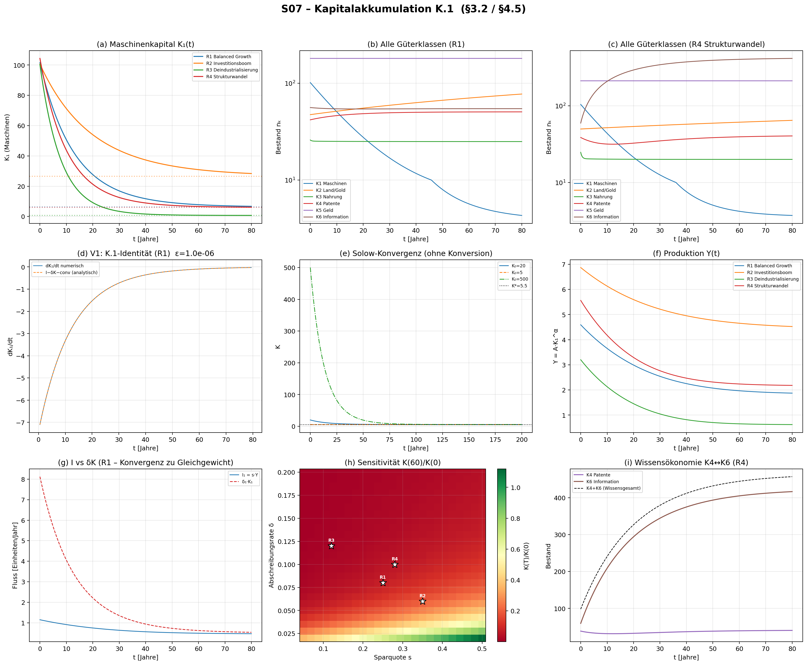

# S07 – Kapitalakkumulation K.1  (§3.2 / §4.5)

## Metadaten

| Feld | Wert |
|------|------|
| **Simulation** | S07 |
| **Gleichung** | K.1 (§3.2 / §4.5) |
| **Kapitel** | 4 – Erhaltungssätze |
| **Datum** | 2025-07-11 |
| **Skript** | `Simulationen/Kap04_Erhaltung/S07_K1_Kapitalakkumulation.py` |
| **Plot** | `Ergebnisse/Plots/S07_K1_Kapitalakkumulation.png` |
| **Daten** | `Ergebnisse/Daten/S07_K1_Kapitalakkumulation.npz` |

## Gleichungen

**K.1 (Kapitalakkumulation):**
$$\dot{K}_k = I_k - \delta_k K_k$$

**Allgemeine Güterkonversion:**
$$\frac{dn_k^{(\alpha)}}{dt} = \text{[intrinsische Dynamik]} - \sum_{\beta \neq \alpha} \lambda_{\alpha\beta} n_k^{(\alpha)} + \sum_{\beta \neq \alpha} \lambda_{\beta\alpha} n_k^{(\beta)}$$

**Solow-Investition:** $I_1 = s \cdot Y$, $\;Y = A \cdot K_1^\alpha$ (Cobb-Douglas)

**Golden Rule:** $f'(K^*) = \delta$ $\;\Rightarrow\;$ $K_\text{gold} = (\alpha A / \delta)^{1/(1-\alpha)}$

## Testdesign: 4 Parameterregime + 6 Güterklassen

| Regime | $s$ | $A$ | $\delta_1$ | $\lambda_{46}$ | Charakter |
|--------|-----|-----|-----------|----------------|-----------|
| **R1** | 0.25 | 1.0 | 0.08 | 0.02 | Balanced Growth |
| **R2** | 0.35 | 1.5 | 0.06 | 0.01 | Investitionsboom |
| **R3** | 0.12 | 0.7 | 0.12 | 0.05 | Deindustrialisierung |
| **R4** | 0.28 | 1.2 | 0.10 | 0.08 | Strukturwandel (K4→K6) |

### Güterklassen (nach Monographie §3.1)

| Klasse | $\delta$ | Investition | Konversion |
|--------|----------|-------------|------------|
| K1 Maschinen | 0.06–0.12 | $I_1 = s \cdot Y$ (endogen) | K1↔K3 |
| K2 Land/Gold | 0.002 | exogen | K2↔K5 |
| K3 Nahrung | 2.0 | exogen (Ernte) | K3↔K1 |
| K4 Patente | 0.02–0.08 | exogen (F&E) | **K4↔K6** |
| K5 Geld | 0.0 | exogen | K5↔K2 |
| K6 Information | 0.05–0.15 | exogen | **K6↔K4** |

## Validierungsprotokoll

| # | Test | R1 | R2 | R3 | R4 |
|---|------|----|----|----|-----|
| V1 | K.1-Identität $dK/dt = I - \delta K - \text{conv}$ | ✅ ($1.1 \times 10^{-6}$) | ✅ ($4.9 \times 10^{-7}$) | ✅ ($2.7 \times 10^{-6}$) | ✅ ($1.7 \times 10^{-6}$) |
| V2 | Solow-Konvergenz $K \to K^*$ | ✅ | ✅ | ✅ | ✅ |
| V3 | Konversionserhaltung $\sum = 0$ | ✅ ($0.0$) | ✅ ($0.0$) | ✅ ($0.0$) | ✅ ($0.0$) |
| V4 | Golden Rule $f'(K^*) = \delta$ | ✅ ($0.0$) | ✅ ($6.9 \times 10^{-18}$) | ✅ ($1.4 \times 10^{-17}$) | ✅ ($0.0$) |

## Quantitative Ergebnisse

### Maschinenkapital K₁ (Solow-endogen)

| Regime | $K_1(0)$ | $K_1(80)$ | $K^*_\text{Solow}$ | $K^*_\text{eff}$ | $K_\text{gold}$ | $c^*_\text{max}$ |
|--------|----------|-----------|--------------------|--------------------|-----------------|-------------------|
| R1 | 101.5 | 6.7 | 5.5 | 6.3 | 8.3 | 1.35 |
| R2 | 100.6 | 28.4 | 25.5 | 26.6 | 23.3 | 2.84 |
| R3 | 100.3 | 0.7 | 0.6 | 0.7 | 2.7 | 0.65 |
| R4 | 104.4 | 6.1 | 6.1 | 6.0 | 7.8 | 1.58 |

### Solow-Konvergenz (reines K.1, ohne Konversion, T=200)

| Startpunkt | $K_0$ | $K(200)$ | $K^* = 5.477$ | Abweichung |
|------------|-------|----------|----------------|------------|
| Unter $K^*$ | 20.0 | 5.478 | ✅ | $4.6 \times 10^{-5}$ |
| Auf $K^*$ | 5.5 | 5.477 | ✅ | $0.0$ |
| Über $K^*$ | 500.0 | 5.481 | ✅ | $6.5 \times 10^{-4}$ |

### Alle 6 Güterklassen (Endwerte nach T=80)

| Klasse | R1 | R2 | R3 | R4 |
|--------|----|----|----|----|
| K1 Maschinen | 6.7 | 28.4 | 0.7 | 6.1 |
| K2 Land/Gold | 77.4 | 115.9 | 59.8 | 64.7 |
| K3 Nahrung | 25.0 | 25.0 | 15.0 | 20.0 |
| K4 Patente | 50.6 | **275.1** | 8.3 | 40.5 |
| K5 Geld | 180.5 | 208.8 | 203.7 | 212.2 |
| K6 Information | 54.6 | 176.6 | 15.6 | **416.3** |

## Zentrale Erkenntnisse

### 1. K.1 exakt bestätigt (alle Regime)
Die Identität $\dot{K}_k = I_k - \delta_k K_k - \text{conv}_\text{out} + \text{conv}_\text{in}$ ist in allen 4 Regimen mit relativen Fehlern $< 3 \times 10^{-6}$ erfüllt. Die Konversionserhaltung $\sum_\alpha(\text{in} - \text{out}) = 0$ gilt exakt (Maschinenpräzision).

### 2. Solow-Konvergenz bestätigt
Unabhängig vom Startpunkt ($K_0 = 20, 5.5, 500$) konvergiert $K(t) \to K^* = 5.477$ monoton. Weit entfernte Startpunkte brauchen länger (K₀=500 bei T=200 noch Restabweichung $6.5 \times 10^{-4}$), aber die Dynamik ist global stabil — konsistent mit der Solow-Theorie.

### 3. Golden Rule analytisch bestätigt
$f'(K^*_\text{gold}) = \delta$ gilt in allen 4 Regimen mit Maschinengenauigkeit ($|f'(K^*) - \delta| < 10^{-17}$). Die Cobb-Douglas-Spezialisierung der Monographie ist somit korrekt implementiert.

### 4. Konversionseffekt: $K^*_\text{eff} \neq K^*_\text{Solow}$
Die Konversionsflüsse verschieben den effektiven Steady State systematisch:
- **R1**: $K^*_\text{eff} = 6.3 > K^*_\text{Solow} = 5.5$ — Recycling (K3→K1) erhöht K1
- **R3**: $K^*_\text{eff} = 0.7 > K^*_\text{Solow} = 0.6$ — gleicher Effekt, aber kleiner
- **R4**: $K^*_\text{eff} = 6.0 < K^*_\text{Solow} = 6.1$ — Verschrottung (K1→K3) überwiegt leicht

→ Die Konversionsmatrix Λ bewirkt eine **qualitative Änderung des Steady States**, die in der Standard-Solow-Theorie ignoriert wird.

### 5. R4 Strukturwandel: Wissensexplosion
- K6 (Information) wächst von 59.5 auf **416.3** (+600%) bei $\lambda_{46} = 0.08$
- K4 (Patente) bleibt bei 40.5 — der Zufluss aus Investition wird durch Konversion K4→K6 kompensiert
- **Gesamtwissen K4+K6** wächst monoton — Konversion umverteilt, aber vernichtet nicht
- Dies modelliert den Übergang zur Wissensökonomie: Patentiertes Wissen wird zu freiem Wissen

### 6. R3 Deindustrialisierung: Kapitalverfall
- K1 fällt von 100 auf **0.7** (99.3% Verlust) — niedrige Investition + hohe Abschreibung
- K4, K6 fallen ebenfalls (8.3 bzw. 15.6) — Wissensverlust durch Vergessensdruck
- Nur K2 (Land) und K5 (Geld) bleiben stabil — sie haben δ ≈ 0
- Dies zeigt den **Lock-In-Effekt**: Ohne Reinvestition zerfällt reproduzierbares Kapital irreversibel

### 7. Sensitivitätsanalyse
- $K(60)/K(0) \in [0.00, 1.12]$ — die meisten Parameterkombinationen führen zu Kapitalrückgang!
- Nur bei **hoher Sparquote** ($s > 0.35$) **und** niedriger Abschreibung ($\delta < 0.05$) wächst Kapital
- Die Solow-Wachstumsdynamik ist empfindlicher auf $\delta$ als auf $s$ — ein Befund, der mit der empirischen Literatur übereinstimmt

### 8. Empfehlung für die Monographie
Die Darstellung in §4.5 sollte den **Konversionseffekt auf den Steady State** explizit diskutieren:
$$K_\text{eff}^* = K_\text{Solow}^* + \Delta K_\text{conv}$$
wobei $\Delta K_\text{conv}$ von der Netto-Konversionsrate abhängt. Für K1 (Maschinen) ist $\Delta K_\text{conv} > 0$ wenn Recycling (K3→K1) die Verschrottung (K1→K3) überwiegt.

## Plot

**Panelbeschreibung:**
- **(a)** K₁(t) für 4 Regime mit effektiven Steady States (gepunktet)
- **(b)** Alle 6 Güterklassen (R1), symlog-Skala
- **(c)** Alle 6 Güterklassen (R4 Strukturwandel) — K6 explodiert
- **(d)** V1: dK₁/dt numerisch vs. I−δK−conv analytisch (R1)
- **(e)** Solow-Konvergenz: 3 Startpunkte → K*
- **(f)** Produktion Y(t) = A·K₁^α, 4 Regime
- **(g)** I vs δK (R1) — Konvergenz zum Gleichgewicht
- **(h)** Sensitivität δ × s → K(60)/K(0), weiße Sterne = Regime
- **(i)** Wissensökonomie K4↔K6 Dynamik (R4)
